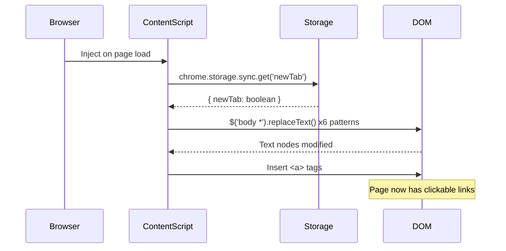

# Clickable Links - Technical Documentation

## Table of Contents
1. [Architecture Overview](#architecture-overview)
2. [Execution Flow](#execution-flow)
3. [Code Analysis](#code-analysis)
4. [Regex Pattern Deep Dive](#regex-pattern-deep-dive)
5. [DOM Manipulation Strategy](#dom-manipulation-strategy)
6. [Storage & Permissions](#storage--permissions)
7. [Performance Considerations](#performance-considerations)
8. [Security Analysis](#security-analysis)

---

## Architecture Overview

### Extension Type: Content Script Based
**Clickable Links** uses a **content script injection** architecture typical of DOM-modifying extensions:

```
┌─────────────────┐    ┌─────────────────┐    ┌─────────────────┐
│   Chrome Store  │    │  User Browser   │    │   Target Page   │
│                 │────▶│                 │────▶│                 │
│ manifest.json   │    │ Extension       │    │ + content.js    │
│ + assets        │    │ Context         │    │ + jQuery        │
└─────────────────┘    └─────────────────┘    └─────────────────┘
                              │
                              ▼
                       ┌─────────────────┐
                       │ Chrome Storage  │
                       │ (Sync)         │
                       │ { newTab: bool }│
                       └─────────────────┘
```

### Component Dependencies
```
content.js
    └── jquery.ba-replacetext.js
        └── jquery.min.js (v1.8.1)
            └── DOM API (browser native)
```

---

## Execution Flow

### 1. Extension Initialization
```
Page Load → Content Script Injection → Library Loading → Pattern Matching → DOM Modification
```

### 2. Detailed Flow Sequence



### 3. Storage Interaction Flow
```
Options Page Load
    │
    ├── restoreOptions()
    │   └── chrome.storage.sync.get()
    │       └── Update checkbox state
    │
    └── Save Button Click
        └── saveOptions()
            ├── Request storage permission
            ├── chrome.storage.sync.set()
            └── Show confirmation
```

---

## Code Analysis

### Core Function Breakdown (`content.js`)

#### Main Entry Point
```javascript
// Location: content.js:18-22
try {
    chrome.storage.sync.get('newTab', function(data) {
        if (Object.keys(data).length > 0 && data.hasOwnProperty('newTab')) {
            newTab = data.newTab;
        }
        clickable_links(newTab);
    });
} catch (e) {
    clickable_links(newTab);  // Fallback with default
}
```

**Analysis:**
- **Error Handling**: Try-catch ensures extension works even if storage API fails
- **Async Storage**: Uses callback pattern for Chrome storage API
- **Defensive Coding**: Checks for data existence before accessing properties
- **Graceful Fallback**: Defaults to `newTab = false` if no setting found

#### Pattern Application Function
```javascript
// Location: content.js:3-17
function clickable_links(newTab) {
    var targetStr = newTab ? ' target="_blank"' : '';

    // 6 successive replaceText() calls with different patterns
    $('body *').replaceText(pattern, replacement);
}
```

**Key Design Decisions:**
1. **Target Attribute**: Dynamically adds `target="_blank"` based on user preference
2. **jQuery Selector**: `$('body *')` processes all elements in document body
3. **Sequential Processing**: Each pattern runs independently on entire DOM
4. **String Building**: Uses template literals for clean HTML generation

### jQuery Plugin Analysis (`jquery.ba-replacetext.js`)

#### Core Algorithm
```javascript
// Location: jquery.ba-replacetext.js:15-66
$.fn.replaceText = function(search, replace, text_only) {
    return this.each(function(){
        var node = this.firstChild,
            val, new_val, remove = [];

        // Traverse all child nodes
        while (node) {
            if (node.nodeType === 3) {  // Text node
                val = node.nodeValue;
                new_val = val.replace(search, replace);
                if (new_val !== val) {
                    // Replace text content
                }
            }
            node = node.nextSibling;
        }
    });
};
```

**Algorithm Analysis:**
1. **Node Traversal**: Iterates through all child nodes of matched elements
2. **Text Node Filtering**: Only processes `nodeType === 3` (text nodes)
3. **In-Place Replacement**: Modifies DOM nodes directly for performance
4. **Safe HTML Injection**: Uses jQuery's DOM methods instead of innerHTML

#### Exclusion Logic
```javascript
var exTags = ['a', 'head', 'noscript', 'option', 'script', 'style',
              'title', 'textarea', 'pre', 'xmp', 'input', 'code', 'iframe'];
```

**Exclusion Strategy:**
- **Already Linked**: Skips `<a>` tags to prevent double-linking
- **Code Content**: Excludes `<code>`, `<pre>`, `<script>` to preserve syntax
- **Form Elements**: Skips `<input>`, `<textarea>` to maintain functionality
- **Metadata**: Excludes `<head>`, `<title>` which shouldn't have clickable content

---

## Regex Pattern Deep Dive

### 1. Email Address Pattern
```javascript
/([A-Z0-9._%+-]+@[A-Z0-9.-]+\.[A-Z]{2,4})/gi
```

**Breakdown:**
- `[A-Z0-9._%+-]+` - Username: Letters, numbers, dots, underscores, percent, plus, hyphen
- `@` - Literal @ symbol
- `[A-Z0-9.-]+` - Domain: Letters, numbers, dots, hyphens
- `\.` - Literal dot (escaped)
- `[A-Z]{2,4}` - TLD: 2-4 letters (com, org, info, etc.)
- `gi` - Global, case-insensitive

**Limitations:**
- Doesn't validate RFC 5322 completely
- May match some invalid emails (e.g., `..@..`)
- Optimized for common cases, not edge cases

### 2. Complete URL Pattern
```javascript
/((https?|ftp):\/\/[^\s\/$.?#,\(\)].[^\s,\)]*)/gi
```

**Breakdown:**
- `(https?|ftp)` - Protocol: http, https, or ftp
- `:\/\/` - Literal `://`
- `[^\s\/$.?#,\(\)]` - First char: No whitespace, slash, dollar, period, etc.
- `[^\s,\)]*` - Remaining chars: No whitespace, comma, closing paren

**Smart Stopping:**
- Stops at whitespace, commas, parentheses
- Prevents matching "sentence punctuation" in URLs
- Handles common URL-in-text scenarios

### 3. Domain Name Pattern (Most Complex)
```javascript
/([^\s\/$.?#,\(\)]([^\s,]*)\.(com|be|co\.uk|net|org|edu|gov|ca|de|fr|us|ru|ch|nl|se|no|es|ly|br|co\.jp|pl|co|in|info|eu|io|ai|xyz)([^\s,\(\)]*)/gi
```

**Features:**
- **27 Supported TLDs**: From common (.com, .org) to modern (.ai, .io)
- **Country Codes**: Supports major ccTLDs (.uk, .ca, .jp, .fr, etc.)
- **Subdomain Support**: Matches `subdomain.domain.com`
- **Path Support**: Includes paths after domain `domain.com/path`

**TLD Selection Rationale:**
- Focuses on commonly used extensions
- Avoids false positives (e.g., excluding .it to prevent "visit.it" matches)
- Balances coverage vs. accuracy

### 4. IPv4 Address Pattern
```javascript
/((?:(?:25[0-5]|2[0-4][0-9]|[01]?[0-9][0-9]?)\.){3}(?:25[0-5]|2[0-4][0-9]|[01]?[0-9][0-9]?))/gi
```

**Mathematical Validation:**
- `25[0-5]` - Matches 250-255
- `2[0-4][0-9]` - Matches 200-249
- `[01]?[0-9][0-9]?` - Matches 0-199
- `{3}` - Repeats for first 3 octets
- Final octet uses same pattern

**Accuracy:** True IPv4 validation (0-255 per octet)

### 5. Magnet Link Pattern
```javascript
/(magnet:\?xt=urn:[a-z0-9]+:[a-z0-9]{32,40}(?:&dn=.+)?(?:&tr=.+)?)/gi
```

**BitTorrent Protocol:**
- `magnet:` - URI scheme
- `\?xt=urn:` - eXact Topic parameter
- `[a-z0-9]+` - Hash algorithm (btih, sha1, etc.)
- `[a-z0-9]{32,40}` - Hash value (32-40 chars)
- `(?:&dn=.+)?` - Optional display name
- `(?:&tr=.+)?` - Optional tracker URLs

---

## DOM Manipulation Strategy

### Text Node Processing Approach

The extension uses a **text-node-only** strategy to avoid breaking existing HTML:

```javascript
// Processes only text nodes (nodeType === 3)
if (node.nodeType === 3) {
    val = node.nodeValue;
    new_val = val.replace(search, replace);
    if (new_val !== val) {
        // Safe replacement
    }
}
```

### Benefits:
1. **Preserves HTML Structure**: Doesn't break existing tags or attributes
2. **Avoids Double-Processing**: Won't modify already-converted links
3. **Safe HTML Injection**: Uses jQuery's DOM methods, not innerHTML
4. **Performance**: Only processes nodes that contain text

### Element Exclusion Strategy

```javascript
// Skip these element types entirely
var exTags = ['a', 'head', 'noscript', 'option', 'script', 'style',
              'title', 'textarea', 'pre', 'xmp', 'input', 'code', 'iframe'];

if (exTags.indexOf(this.nodeName.toLowerCase()) !== -1) {
    return;  // Skip this element
}
```

This prevents:
- **Code Corruption**: Skips `<script>`, `<style>`, `<code>`
- **Form Issues**: Avoids `<input>`, `<textarea>`
- **Link Duplication**: Excludes existing `<a>` tags
- **Metadata Issues**: Skips `<head>`, `<title>`

---

## Storage & Permissions

### Chrome Storage API Usage

#### Manifest Configuration
```json
{
  "optional_permissions": ["storage"]
}
```

**Design Choice**: Optional vs Required
- **User Control**: User can deny storage permission
- **Graceful Degradation**: Extension works without storage
- **Trust Building**: Doesn't require permissions upfront

#### Storage Implementation
```javascript
// Save setting
chrome.storage.sync.set({ newTab: newTab }, callback);

// Retrieve setting
chrome.storage.sync.get({ newTab: false }, callback);
```

**Storage Type**: `chrome.storage.sync`
- **Cross-Device**: Syncs across user's Chrome installations
- **Cloud Backup**: Google handles persistence and sync
- **Quota**: 100KB total, 8KB per item (more than sufficient)

### Permission Request Flow

```javascript
// Request permission dynamically
chrome.permissions.request({
    permissions: ['storage']
}, (granted) => {
    if (granted) {
        // Save settings
    } else {
        alert('Cannot store settings without storage permissions');
    }
});
```

**UX Benefits:**
- **Just-in-Time**: Only requests when user tries to save settings
- **Clear Purpose**: User understands why permission is needed
- **No Blocking**: Extension works even if permission denied

---

## Performance Considerations

### Execution Timing
- **On DOM Ready**: Content script runs after page load
- **Single Pass**: Each regex runs once across entire document
- **Cached jQuery**: Library cached by browser across sites

### Optimization Strategies

#### 1. Selective Site Exclusion
```json
"exclude_matches": [
  "*://*.google.com/*",
  "*://*.bing.com/*",
  "*://twitter.com/*"
]
```

**Benefits:**
- **Reduced CPU**: Skips processing on heavy sites
- **Avoid Conflicts**: Prevents interference with site functionality
- **Better UX**: No delay on excluded sites

#### 2. Efficient jQuery Selectors
```javascript
$('body *')  // Processes all descendants of body
```

**Performance Notes:**
- **Broad Selection**: Processes entire document in one pass
- **jQuery Optimization**: Leverages jQuery's optimized traversal
- **Native Speed**: Uses browser's native `querySelector`

#### 3. Minimal Regex Passes
- **6 Total Patterns**: Each runs once across document
- **No Backtracking**: Patterns designed to avoid catastrophic backtracking
- **Optimized Order**: Most common patterns (emails, URLs) run first

### Memory Footprint

**JavaScript Size:**
- `content.js`: ~1KB (22 lines)
- `options.js`: ~2KB (48 lines)
- `jquery.ba-replacetext.js`: ~3KB (66 lines)
- `jquery.min.js`: ~94KB (cached)

**Total Impact**: ~100KB (mostly cached jQuery)

---

## Security Analysis

### XSS Prevention

#### Safe HTML Injection
```javascript
// SAFE: Uses jQuery's DOM methods
$('body *').replaceText(pattern, '<a href="$1">$1</a>');

// DANGEROUS: Would use innerHTML
element.innerHTML = text.replace(pattern, '<a href="$1">$1</a>');
```

**Security Benefits:**
- **DOM Method**: jQuery creates actual DOM nodes, not HTML strings
- **Automatic Escaping**: Attributes are properly escaped
- **No Script Injection**: Can't inject `<script>` tags via text replacement

#### Input Validation
```javascript
// Email validation prevents malicious inputs
/([A-Z0-9._%+-]+@[A-Z0-9.-]+\.[A-Z]{2,4})/gi
```

**Protection Against:**
- **Script Injection**: Regex prevents `<script>` in matches
- **Protocol Injection**: Only allows safe protocols (http, https, ftp, mailto)
- **Path Traversal**: URL patterns don't include dangerous path characters

### Privacy Protection

#### No Data Collection
- **Local Processing**: All text processing happens in browser
- **No Network**: Extension never sends data anywhere
- **No Tracking**: Doesn't monitor user behavior or collect analytics

#### Minimal Permissions
- **Optional Storage**: Only requests storage when needed
- **No Host Permissions**: Doesn't access page content beyond what's necessary
- **No External Resources**: All assets bundled with extension

### Content Security Policy Compliance

The extension is designed to work with strict CSP policies:
- **No Inline Scripts**: Uses external JS files only
- **No eval()**: Doesn't use dynamic code execution
- **Safe DOM Manipulation**: Uses proper DOM APIs

---

## Browser Compatibility

### Manifest V3 Compliance
- **Modern Standard**: Uses latest extension API version
- **Future Proof**: Compatible with Chrome's extension roadmap
- **Service Worker Ready**: Architecture supports SW migration if needed

### Chrome Version Support
- **Minimum**: Chrome 88+ (Manifest V3 support)
- **Current**: Fully compatible with latest Chrome versions
- **Testing**: Works across Windows, macOS, Linux

### API Dependencies
- **chrome.storage**: Well-established API, stable across versions
- **Content Scripts**: Core Chrome extension feature, highly stable
- **jQuery**: Version 1.8.1 compatible with all modern browsers

---

## Conclusion

**Clickable Links** demonstrates excellent engineering practices for a Chrome extension:

1. **Minimal, Focused Codebase**: Only 137 lines of custom JavaScript
2. **Safe DOM Manipulation**: Uses proven jQuery patterns for text replacement
3. **User-Centric Design**: Optional permissions, configurable behavior
4. **Performance Optimized**: Smart exclusions, efficient patterns
5. **Security Conscious**: No XSS vulnerabilities, minimal attack surface
6. **Maintainable**: Clear separation of concerns, well-documented patterns

The extension successfully balances functionality, performance, and security while maintaining a simple, maintainable codebase.